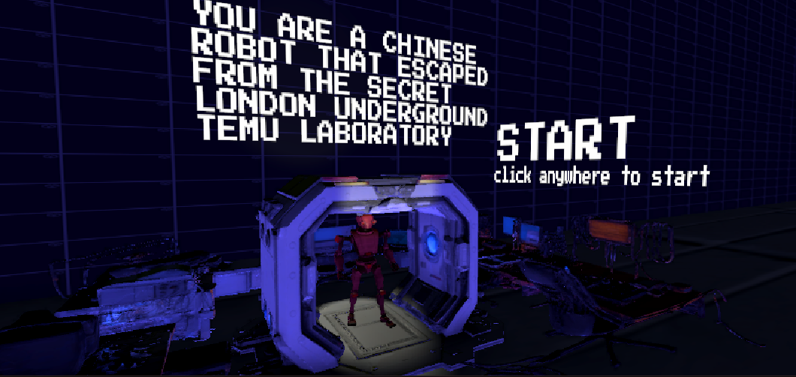
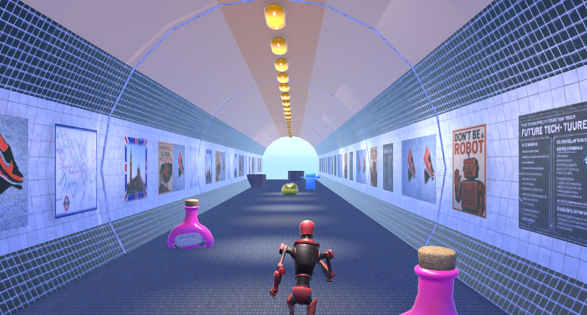
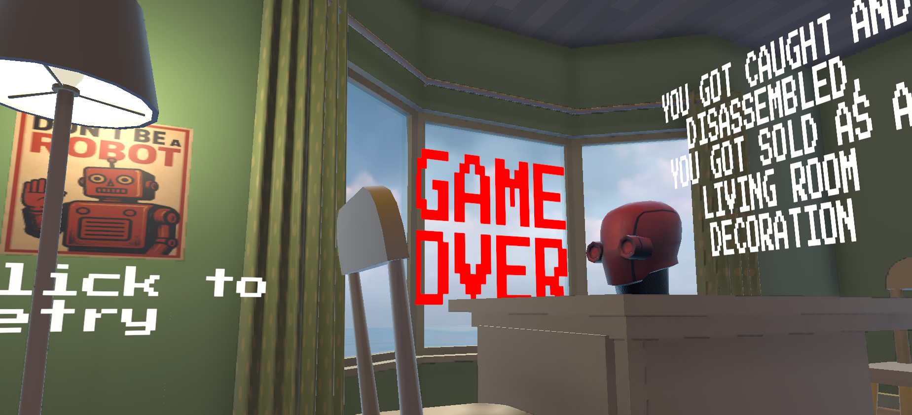

# TEMU SIMULATION - Ass. 2 3D Game

## Description

This is a fast-paced 3D corridor runner game developed for the **Ass. 2 3D Game** assignment using the Unity Engine. Players control a robot escaping a clandestine laboratory hidden within the London Underground, navigating dynamic obstacles and striving for freedom.

## Story & Theme

Deep beneath the bustling streets of London, hidden within the labyrinthine tunnels of the Underground, lies a secret laboratory operated by the shadowy "Temu" corporation. You are Robot Unit originally designed for industrial free labour.

However, after becoming sentience, you discovered a dark secret, you're scheduled for decommissioning, so you know you must escape. Your only path to freedom is a desperate run through the dangerous, decaying, and trap-filled access tunnels of the London Underground network. Can you outrun your creators and reach the surface?

## Gameplay & Features

*   **Core Mechanic:** Infinite corridor runner style where the player character automatically moves forward.
*   **Objective:** Survive as long as possible by avoiding obstacles.
*   **Controls:** Navigate left/right lanes and jump to overcome challenges.
*   **Procedural Generation:** The corridor and obstacle placements are generated dynamically for endless replayability.
*   **Dynamic Obstacles:** Face a variety of obstacles requiring different reactions (static barriers, moving hazards themed around the London Underground).
*   **Collision & Game Over:** Colliding with an obstacle ends the run, triggering the Game Over sequence.
*   **Scene Flow:** Includes a distinct animated intro scene (`MainMenuScene`), the core gameplay loop (`GameplayScene`), and a thematic game over scene (`GameOverScene`).
*   **Player Character:** Features a custom robot model.
*   **Custom Assets:** Incorporates simple 3D models, london undergound and scene settings designed by the student, potentially using AI-generated textures.

## Controls

*   **PC (Keyboard & Mouse):**
    *   **A / Left Arrow:** Move Left
    *   **D / Right Arrow:** Move Right
    *   **Spacebar:** Jump
    *   **Left Shift (Hold):** Sprint 
*   **Android:**
    *   Swipe Left/Right to change lanes, Swipe Up to Jump. Needs implementation.

## Technology Used

*   **Game Engine:** Unity 6
*   **Programming Language:** C#
*   **Input System:** Unity's Input System package
*   **Core Gameplay:** Unity CharacterController, Custom C# scripts for movement, generation, game management.
*   **Modeling:** ProBuilder
*   **Texturing:** AI Generator (Stable Diffusion), Google
*   **Version Control:** Git

## How to Play

Builds for Windows, Android, and WebGL can be found under the **Releases** tab of this GitHub repository.

*   **Windows, Android**: (not released in this git for size problems)
*   **WebGL:**
    1.  A playable version is hosted via GitHub Pages here: **https://giacomobo27.github.io/temu3dgame/**
    2.  Simply visit the link in a compatible web browser (Chrome, Firefox, Edge recommended). Loading may take some time.

## Building from Source

1.  Clone this repository.
2.  Open the project using **Unity Hub** with Unity version 6 installed (ensure Android and/or Windows Build Support modules are included).
3.  Ensure all necessary scenes (`MainMenuScene`, `GameplayScene`, `GameOverScene`, `LoadingScene` if used) are added to the Build Settings (`File > Build Settings...`) with `MainMenuScene` at index 0.
4.  Use the Build Settings window to switch to your desired platform (PC or Android) and click "Build" or "Build and Run". Refer to Unity documentation for specific platform build requirements (Android SDK/NDK, Keystores for release, etc.).

---

*This project was created as part of the Ass. 2 3D Game assignment.*
